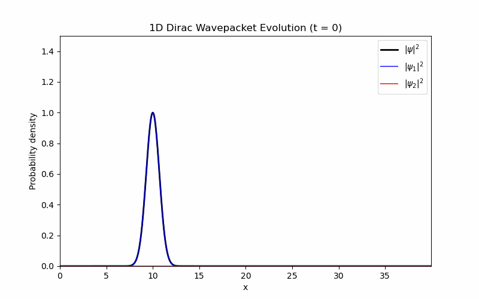

# One-dimensional Dirac Equation Simulations

This repository contains numerical simulations of the one-dimensional Dirac equation, implemented in C++ using finite-difference methods and explicit time integration. The simulations focus on time-dependent wavepacket dynamics and illustrate phenomena that have no analogue in non-relativistic quantum mechanics.

Two physically distinct scenarios are shown:
1. Free relativistic wavepacket propagation.
2. Klein tunnelling at a supercritical potential step.

Both simulations evolve the full Dirac spinor and explicitly resolve the coupling between spinor components induced by relativistic dynamics.

-----------------------------------------------------------------------

## Free Dirac Wavepacket Propagation

The first project considers the time evolution of a free relativistic wavepacket governed by the one-dimensional Dirac equation in natural units (c = hbar = 1):

i d/dt Psi(x,t) = [ -i alpha d/dx + beta m ] Psi(x,t)

where Psi(x,t) is a two-component spinor and alpha, beta are Dirac matrices in the standard representation.

A Gaussian wavepacket with nonzero mean momentum is initialized in one spinor component. Although the initial state resembles a non-relativistic wavepacket, time evolution under the Dirac Hamiltonian leads to intrinsically relativistic effects, including:
- coupling between spinor components,
- modified dispersion relative to the Schrodinger equation,
- subluminal group velocity determined by the relativistic energy-momentum relation.

The numerical evolution directly demonstrates how relativistic kinematics emerge dynamically from the Dirac equation, even in one spatial dimension.

An example animation of free propagation is shown below.

-----------------------------------------------------------------------

## Klein Paradox: Supercritical Step Potential

The second project studies the interaction of a relativistic wavepacket with a sharp potential step and demonstrates the Klein paradox.

The Hamiltonian is modified by a spatially dependent scalar potential V(x):

i d/dt Psi(x,t) = [ -i alpha d/dx + beta m + V(x) ] Psi(x,t)

with
V(x) = 0 for x < x0
V(x) = V0 for x >= x0

The step height V0 is chosen to be supercritical, satisfying V0 > 2m. In this regime, the energy spectrum inside the step region overlaps with the negative-energy continuum of the free Dirac equation.

A localized wavepacket incident on the step exhibits three key features:
1. Partial reflection at the interface.
2. Transmission into the step region despite the potential being higher than the particle energy.
3. Propagation inside the step region with finite group velocity, rather than exponential decay.

This transmission is not tunnelling in the non-relativistic sense. Instead, it arises from the availability of negative-energy solutions in the step region, which correspond to antiparticle states in relativistic quantum theory. The paradoxical increase in transmission probability with increasing potential height is a direct consequence of the Dirac spectrum and has no analogue in the Schrodinger equation.

The numerical simulation resolves this behavior dynamically by evolving the full spinor wavefunction in time. Spinor component mixing becomes significant near the step, confirming that the effect is genuinely relativistic and not an artifact of scalar wave propagation.

The animation below shows the incident wavepacket splitting into reflected and transmitted components, with a clearly propagating density inside the supercritical step region.

-----------------------------------------------------------------------

## Summary

These simulations demonstrate how relativistic quantum phenomena emerge naturally from time-dependent solutions of the Dirac equation. In particular, the Klein paradox example provides a direct numerical visualization of a fundamentally relativistic effect that cannot be reproduced within non-relativistic quantum mechanics.
